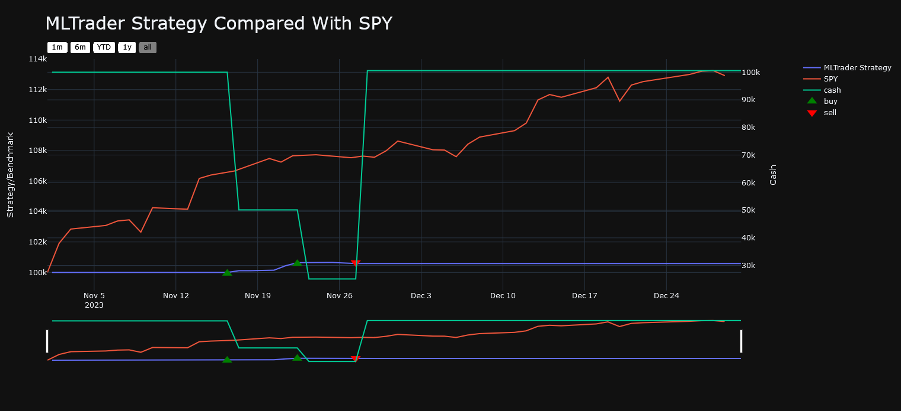

# limubot-traiding-news

Matthieu Hanania & Antoine Boucher from [Algo ETS](https://github.com/AlgoETS)

The aim of this project is to use Alpaca and lumibot to simulate a buy/sell on the stock market depending of the global positivity or negativity opinion on a certain stock

## Exemple of a simulation on the SPY

